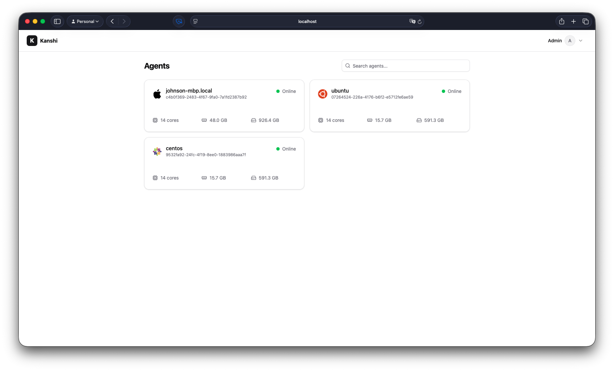
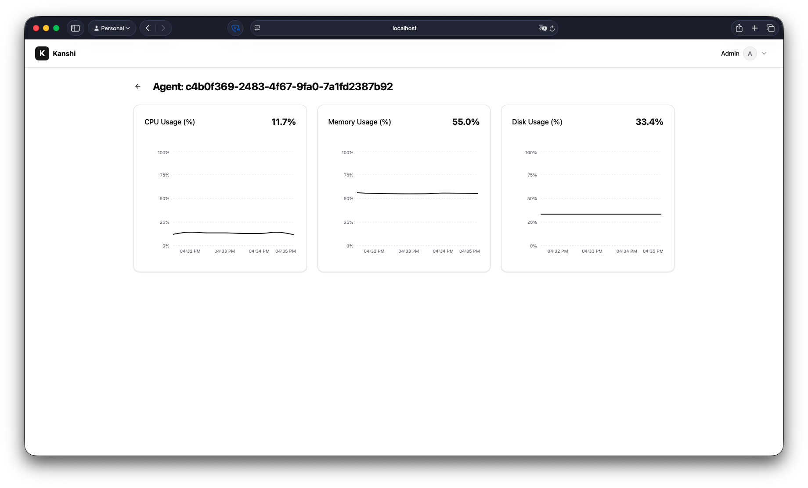

# Kanshi Monitoring System

Kanshi is a monitoring solution built with a core service for data collection, a TimescaleDB-powered database for efficient metrics storage, and a dashboard for visualization.

## Architecture

The system consists of three main components:
- **[Kanshi Core](https://github.com/kanshi-dev/core)**: The central service that receives metrics from agents.
- **TimescaleDB**: A time-series database optimized for metrics storage.
- **[Kanshi Dashboard](https://github.com/kanshi-dev/dashboard)**: A user-friendly web interface to visualize metrics and monitor your infrastructure.
- **[Kanshi Agent](https://github.com/kanshi-dev/agent)**: A lightweight component installed on the machines you want to monitor, which collects and sends data to the core.

## Prerequisites

- [Docker](https://www.docker.com/get-started)
- [Docker Compose](https://docs.docker.com/compose/install/)

## Getting Started

### 1. Configure the Environment

Create a `.env` file in the root directory with the following database credentials:

```env
DB_HOST="db"
DB_PORT="5432"
DB_USER="kanshi"
DB_PASSWORD="yourpassword"
DB_NAME="kanshi"
```

### 2. Start the Monitoring Stack

Run the following command to start the core service, dashboard, and database:

```bash
docker-compose up -d
```

This will:
- Initialize the TimescaleDB database with the required schema (`core-schema.sql`).
- Start the core service on ports `8080` (HTTP) and `50051` (gRPC).
- Start the dashboard on port `80`.

### 3. Deploy the Kanshi Agent

The Kanshi agent is used to collect metrics from your servers. Download the latest release (v0.1.0) for your platform from:

👉 [Kanshi Agent v0.1.0 Releases](https://github.com/kanshi-dev/agent/releases/tag/v0.1.0)

Once downloaded, run the agent on the target machine, pointing it to your Kanshi Core service address. For example:

```bash
KANSHI_CORE_ADDR=core_url:50051 ./kanshi-agent
```

## Visualization

After the services are up and running, you can access the Kanshi Dashboard by navigating to `http://localhost` in your web browser.

### Agent Overview


### Detailed Metrics


## Database Schema

The system uses `core-schema.sql` to automatically set up the `metrics` hypertable and `agents` table in TimescaleDB.

- **Metrics Table**: Stores time-series data (agent_id, name, value, ts, tags).
- **Agents Table**: Stores metadata about monitored machines (hostname, OS, platform, hardware specs).
