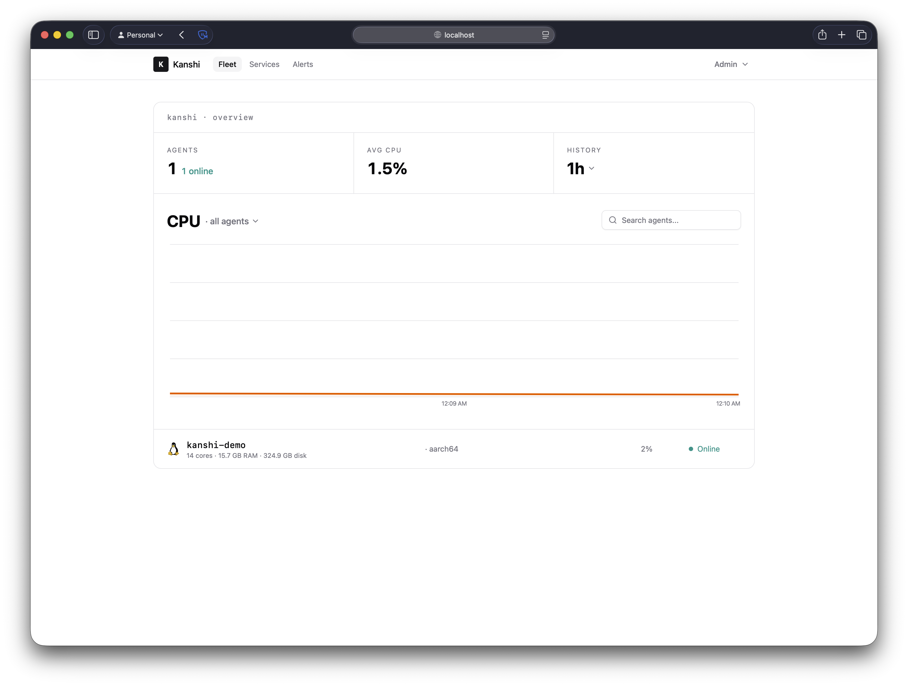
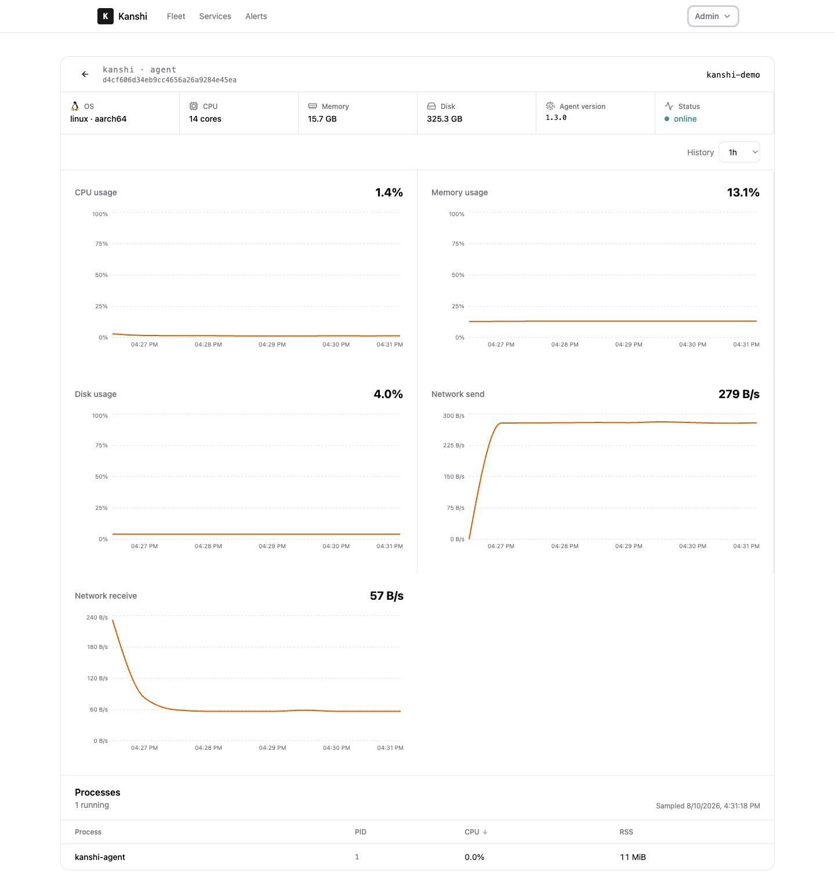

# Kanshi demo

Run Kanshi locally from the current stable release. This repository is the fastest self-contained path for testing the dashboard, Core, TimescaleDB, Agent, OpenTelemetry Collector, and instrumented services without creating AWS resources.

## Requirements

- Docker with Compose
- OpenSSL
- curl

## Start the stack

```sh
git clone https://github.com/kanshi-dev/demo.git
cd demo
make up
```

`make up` generates a private `.env`, pulls Kanshi `v1.2.0`, builds the sample services and Agent image, starts the stack, and prints the dashboard key. Core initializes the schema with 30-day host metric retention, 7-day trace retention, and 3-day log retention.

Open [http://localhost:3000](http://localhost:3000) and enter the printed dashboard key. Run `make keys` to print it again.

## Try application observability

The Go checkout service and Node.js payment service include the official OpenTelemetry SDKs. They send OTLP traces and correlated logs to the bundled Collector, which authenticates to Core. No local OpenTelemetry installation is required.

```sh
curl http://localhost:8081/checkout
```

The payment service deliberately returns `503` so the trace has an error to investigate. Open the dashboard **Services** page to search the trace, inspect its span waterfall, and view logs linked to each span.

The stack also runs Kanshi Agent. Its container host appears on the **Agents** page with live CPU and memory metrics.

Run the repeatable end-to-end check:

```sh
make verify
```

It verifies rejected unauthenticated requests, query limits, the two-service trace, correlated logs, Agent CPU and memory, and graceful sample service shutdown and restart.

## Try alerting

The stack ships a bundled webhook sink and configures Core to deliver signed alert webhooks to it. Once an agent is reporting (see above), fire a sample alert on real data:

```sh
make demo-alert
```

This checks for a reporting agent and its memory metrics, creates an enabled `mem.used_percent > 1` rule that live data breaches, and prints the signed webhook Core delivers, including its `X-Kanshi-Signature`. If no agent is reporting yet, it says so instead of fabricating data. Manage rules and watch active alerts and history on the dashboard **Alerts** page, and stream deliveries with `make alert-logs`.

## Screens

### Fleet overview



### Agent details



## Stop

```sh
make down
```

Run `make reset` when you also want to delete local telemetry, the Agent identity, and generated keys. A clean-machine repeat is:

```sh
make reset
make up
make verify
```

For the AWS test environment, use the [Terraform demo](https://github.com/kanshi-dev/infra). For component details, see the [Kanshi documentation](https://kanshi.dev/docs/).
