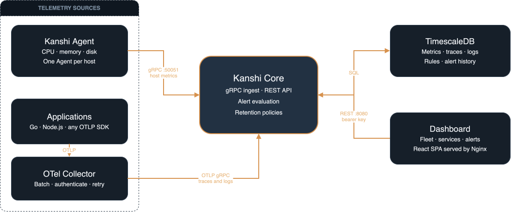
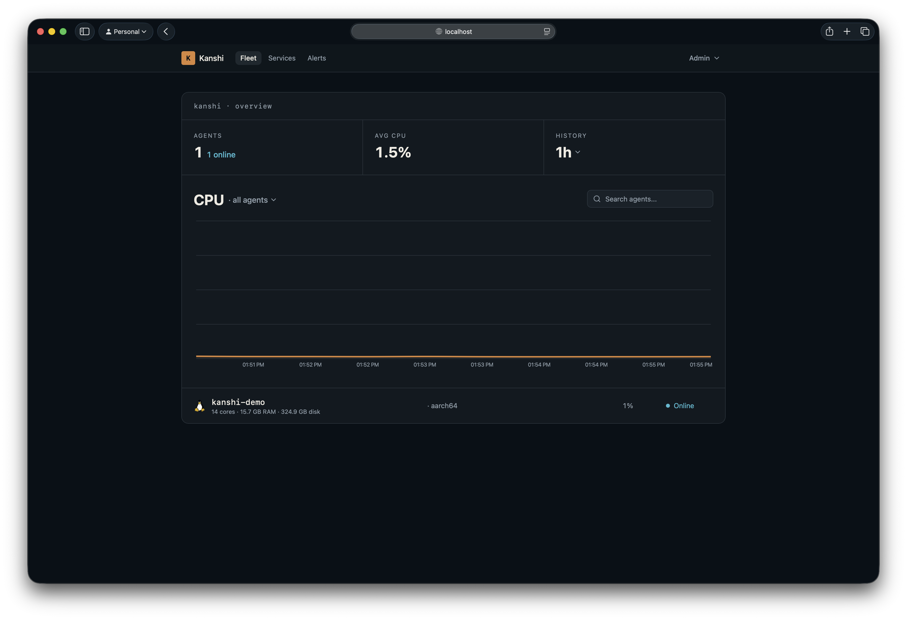
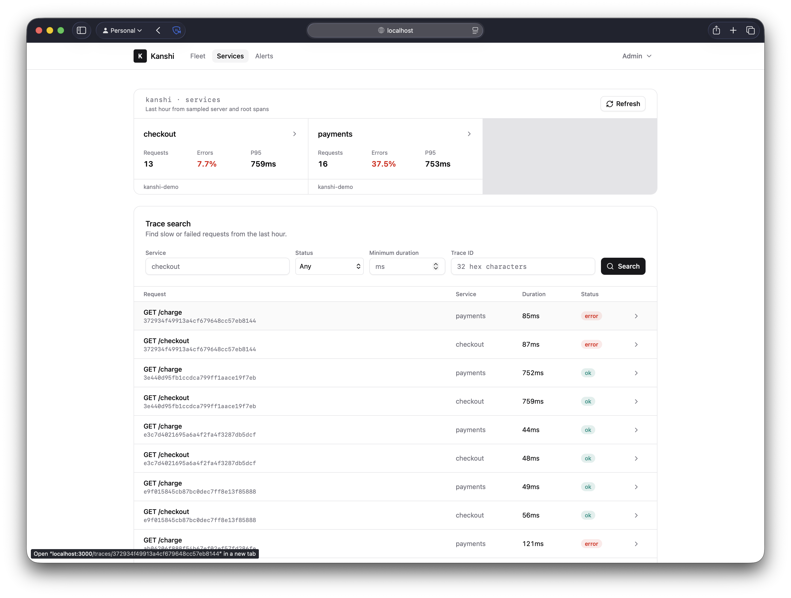
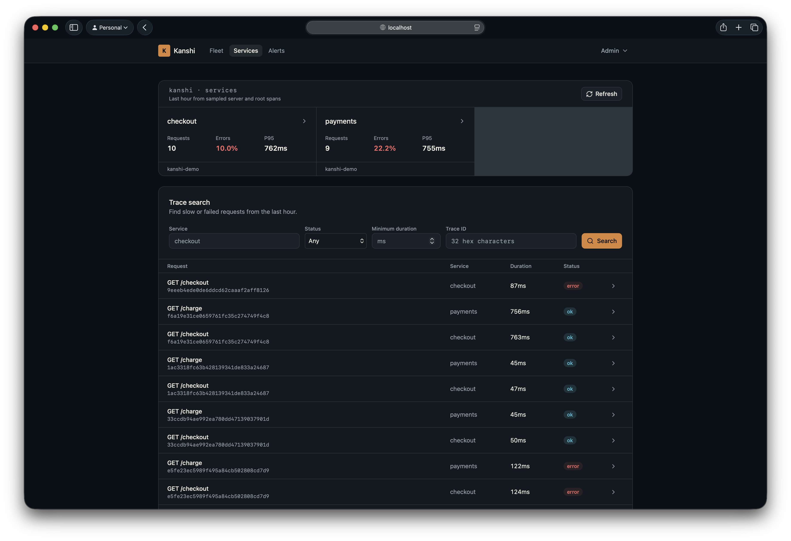
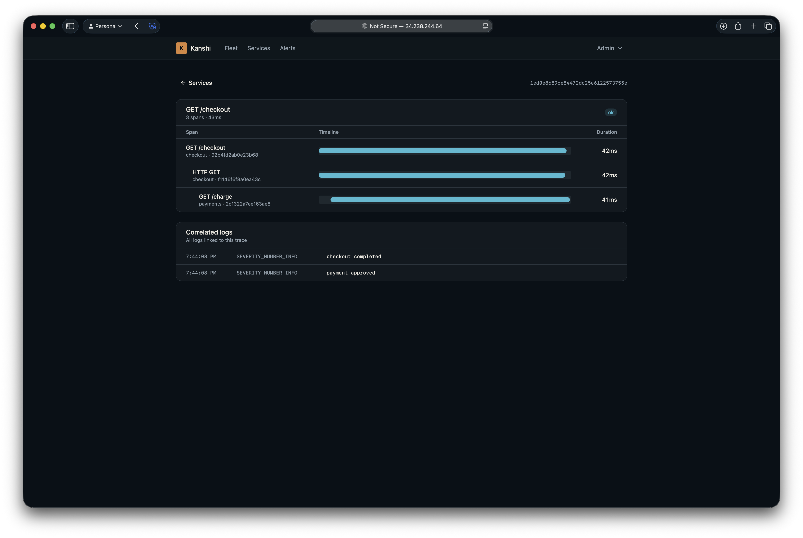
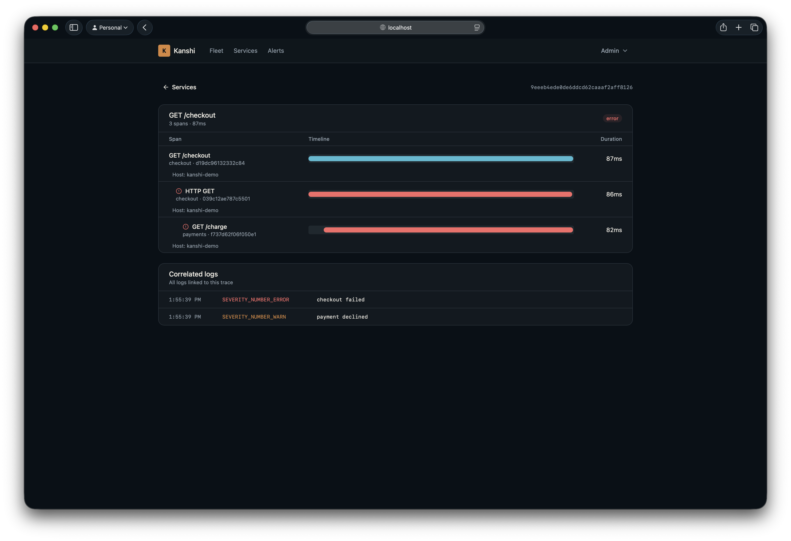
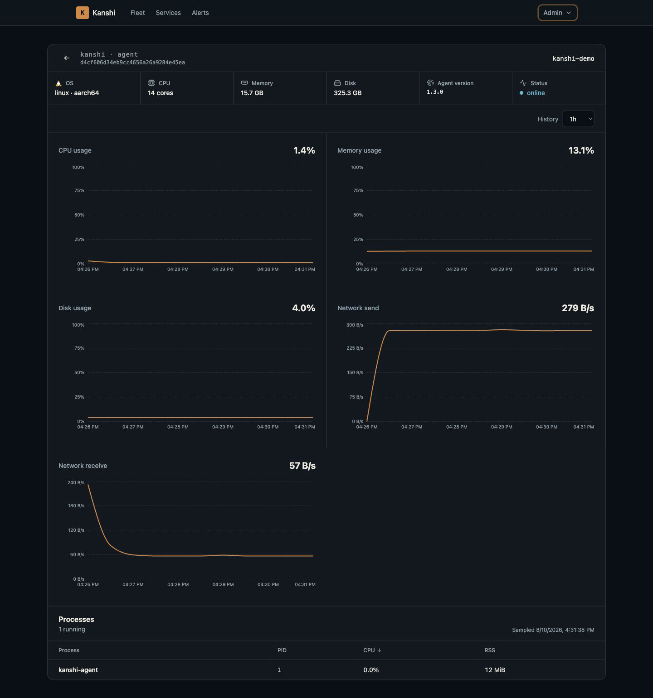
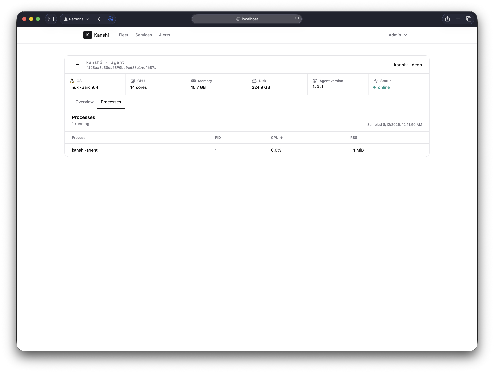
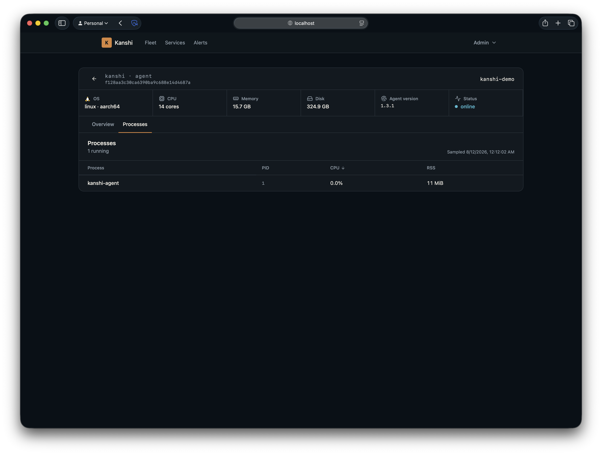
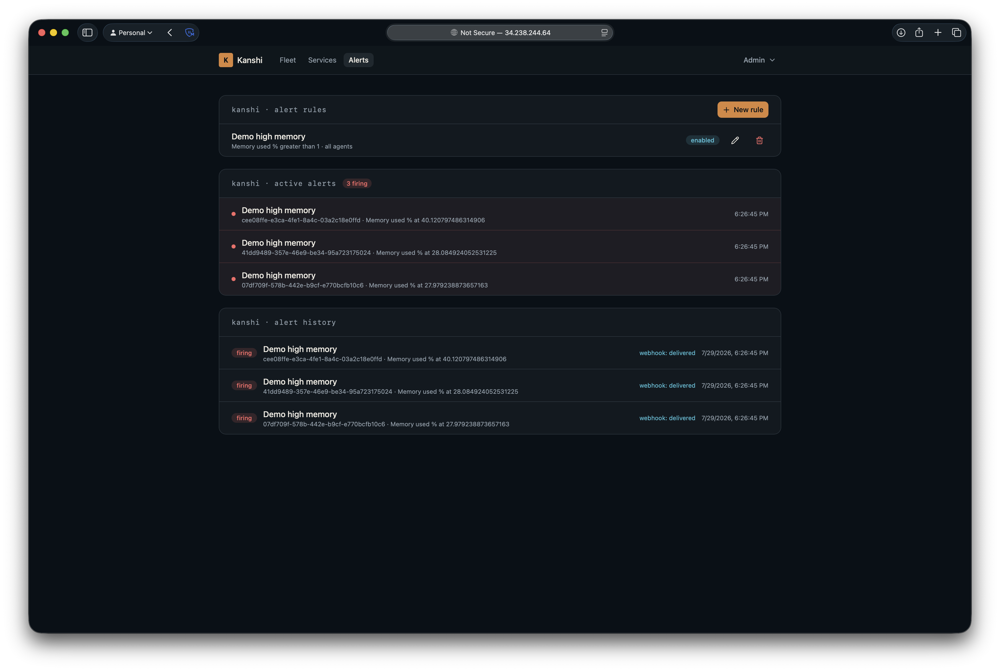

# Kanshi demo

Run Kanshi locally from the current stable release. This repository is the fastest self-contained path for testing the dashboard, Core, TimescaleDB, Agent, OpenTelemetry Collector, and instrumented services without creating AWS resources.



## Requirements

- Docker with Compose
- OpenSSL
- curl

## Start the stack

```sh
git clone https://github.com/kanshi-dev/demo.git
cd demo
make up
```

`make up` generates private keys and a non-secret Agent ID, seeds the Agent identity volume, pulls the stable Core and Dashboard images, builds the stable Agent, starts the stack, and prints the dashboard key. The Demo enables process telemetry as an explicit opt-in example. Checkout and Payments report the same Agent ID and `host.name`, so services and trace spans link to the monitored host. The Demo Driver generates mixed checkout traffic, creates the memory alert rule, and receives its webhooks.

Open [http://localhost:3000](http://localhost:3000) and enter the printed dashboard key. Run `make keys` to print it again.




## Try application observability

Checkout and Payments send OTLP traces and correlated logs through the bundled Collector. No local OpenTelemetry installation is required.

```sh
curl http://localhost:8081/checkout
curl "http://localhost:8081/checkout?scenario=slow"
curl "http://localhost:8081/checkout?scenario=declined"
curl "http://localhost:8081/checkout?scenario=error"
```

Requests cycle through successful, slow, declined, and unavailable payments. Open **Services** to compare outcomes and latency.





Open a trace to inspect its span waterfall and correlated logs.





Run the repeatable end-to-end check:

```sh
make verify
```

It verifies rejected unauthenticated requests, query limits, successful and failed API outcomes, service and trace host links, Agent navigation identity, a two-service trace, correlated logs, Agent CPU, memory, network, process count, process CPU, process RSS, alerts, and graceful sample service shutdown and restart.

The containerized Agent also reports live CPU, memory, and disk metrics.




Open the **Processes** tab to compare the newest opt-in CPU and resident-memory samples.





## Try alerting

The Demo Driver creates a `mem.used_percent > 1` rule. Core fires it after the Agent reports and delivers the signed webhook back to the driver.



Print the delivered webhook:

```sh
make demo-alert
```

`make demo-alert` reads the sink log without creating another rule. Stream future deliveries with `make alert-logs`.

## Stop

```sh
make down
```

Run `make reset` when you also want to delete local telemetry, the Agent identity, and generated keys. A clean-machine repeat is:

```sh
make reset
make up
make verify
```

For the AWS test environment, use the [Terraform demo](https://github.com/kanshi-dev/infra). For component details, see the [Kanshi documentation](https://kanshi.dev/docs/).
